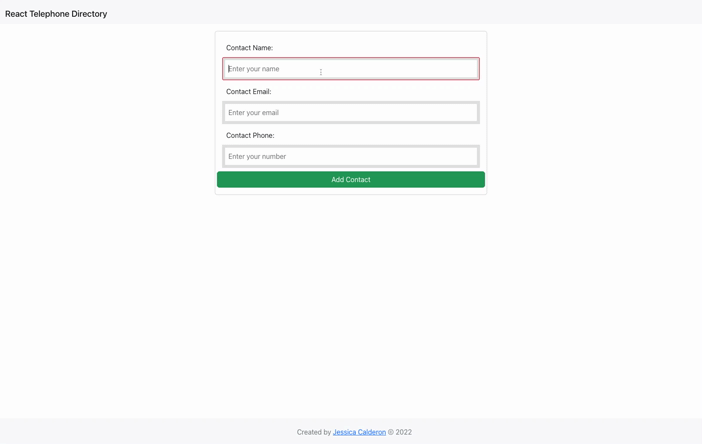

# React Telephone Directory

## Table of Contents
* [Description](#description)
* [Built With](#languages)
* [Contributing](#contributing)
* [Testing](#tests)
* [Questions](#questions)
* [Installation](#installation)
* [Application Preview](#application-preview)

## [Description](#table-of-contents)
A simple telephone directory where users can add, delete, and see a list of all contacts.
Contact lists include: 
* name 
* phone number
* email

## [Languages](#table-of-contents)
HTML, Bootstrap CSS, JavaScript, Node.js, React.js

## [Usage](#table-of-contents)
npm start

## [Testing](#table-of-contents)
Currently n/a

## [Contributing](#table-of-contents)

Thank you for your interest in contributing to this project, however, I am currently not accepting third party contributions.
      

## [Installation](#table-of-contents)
`git clone git@github.com:jessica-calderon/address-book.git`

`npm i`

`npm start`

## [Application Preview](#table-of-contents)
Live Deployment: https://react-phone-app.herokuapp.com/

## [Questions](#table-of-contents)
Questions? Please contact me at the following links:  
[GitHub](https://github.com/jessica-calderon)  
[Email: calderonjessica13@yahoo.com](mailto:calderonjessica13@yahoo.com)
